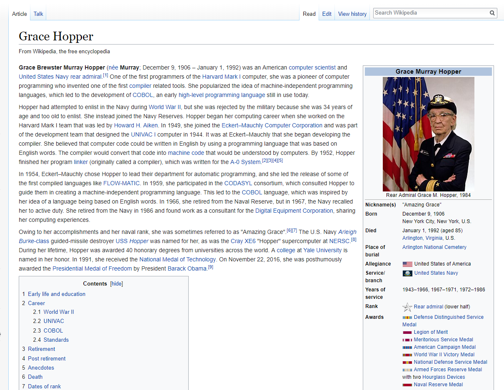
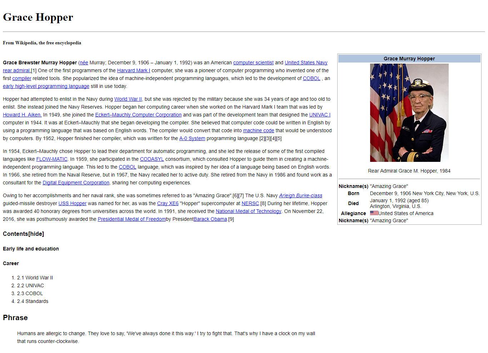

# Replicando Grace-Hopper

En éste trabajo se busca utilizar herramientas básicas en HTML y CSS con el fin de tener un primer acercamiento a las herramientas.

El objetivo a lograr sería lo más cercano a la siguiente imagen:

Trabajo obtenido:

